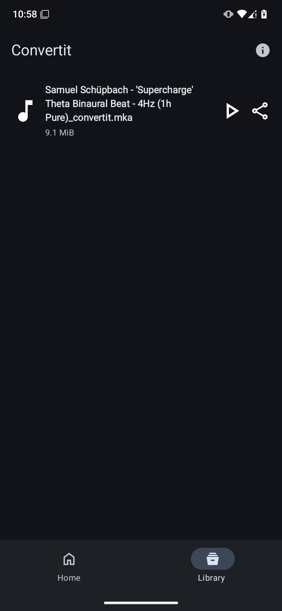

# ConvertIt - Audio & Video Converter/Tools


#### **ConvertIt** is an ad free audio/video converter and metadata editor app built using kotlin & compose and powered by ffmpeg and taglib

<<<<<<< Updated upstream

#### Features
- **Multiple Formats** : **FLAC, MP3, WAV, AAC, OGG, M4A, AIFF, OPUS, WMA, MKA, SPX**, and more.
- **Bitrate Options** : Choose from bitrates such as **64k, 96k, 128k, 192k, 256k, 320k, 512k, 768k, and 1024k** for output quality.
=======
## Features
- **Multiple Formats** : **FLAC, MP3, WAV, AAC, OGG, M4A, AIFF, OPUS, WMA, MKA, SPX, AMR WB**, and more.
- **Bitrate Options** : Choose from bitrates such as **9k, 16k, 24k, 32k, 48k, 64k, 96k, 128k, 192k, 256k, 320k, 512k, 768k, and 1024k** for output quality.
>>>>>>> Stashed changes
- **Modern Design** : Uses MaterialYou(aka Material3).
- **Ad-Free** : Completely free and no annoying Ads.
- **User-Friendly-UI** : The UI and Conversion flow is so simple that everyone can figure out with nearly zero effort.

---

## Screenshots

<p align="left">
  
  
  
  
</p>

---

## Download

Download **ConvertIt** from multiple sources:

<p align="left">
  <a href="https://play.google.com/store/apps/details?id=com.nasahacker.convertit" target="_blank">
    
  </a>
  <br/>
  <a href="https://github.com/thebytearray/Convertit/releases" target="_blank">
    
  </a>
</p>

---

# Certificate Fingerprints for Verification

To ensure the integrity and authenticity of the app, you can verify the certificate fingerprints for the following platforms:

## 1. GitHub

**MD5 Fingerprint:**

```
D2:61:D3:81:CB:02:C3:66:1B:7B:E0:D9:D0:8E:17:BA
```
**SHA-1 Fingerprint:**

```
E4:7F:C6:11:3A:EB:D5:49:3E:AC:91:88:24:3D:F9:B8:08:F1:FC:9C
```
**SHA-256 Fingerprint:**

```
34:52:C6:EF:73:DA:36:31:FA:4E:85:B7:F3:7B:6E:23:F1:64:D9:86:0D:9C:AF:6F:F1:BB:95:DC:89:D3:CF:D4
```
## 2. Google Play Store

**MD5 Fingerprint:**

```
EA:4D:D4:A0:F8:26:11:E7:A7:72:6E:26:1D:A3:60:62
```
**SHA-1 Fingerprint:**

```
B5:53:A9:A1:8F:AF:4E:E9:3A:58:BA:45:68:1C:A4:A5:87:F4:09:A9
```
**SHA-256 Fingerprint:**
```
30:63:A9:0F:E1:24:58:15:66:50:46:5A:50:41:56:4A:5C:C9:96:6E:B6:8C:29:81:E0:FC:39:B6:A4:62:ED:41
```

### How to Verify the Fingerprints:
1. Obtain the certificate fingerprint from the app or build package you are installing.
2. Compare the obtained fingerprints with the ones listed above.
3. Ensure that the fingerprints match exactly to verify the integrity and authenticity of the app.

This will ensure that you're installing the original, untampered version of the app.


---


Every contribution, big or small, helps keep this project alive and ad-free. Thank you! 💖

---

## Contributions

Contributions are always welcome! Here's how you can contribute:
1. **Fork** the repository.
2. Create a **new branch** with your changes.
3. **Submit a pull request**.

Whether it's bug fixes, new features, or improvements, we appreciate your contribution!

---

## License

This project is licensed under the **Apache License 2.0**. See the [LICENSE](LICENSE) file for more information.

---

> "No ads, no nags, does what it is supposed to."  
> — Anonymous User

---