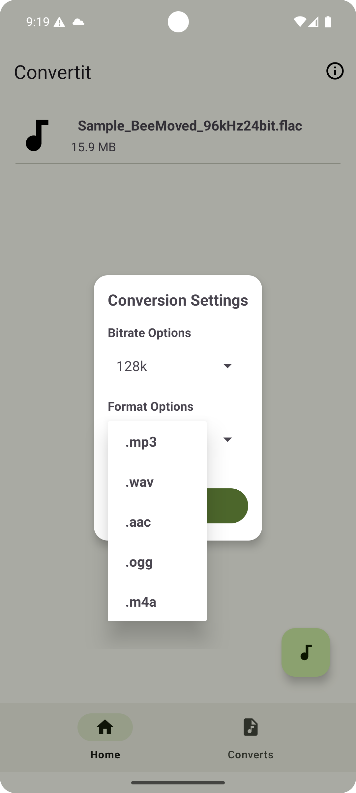
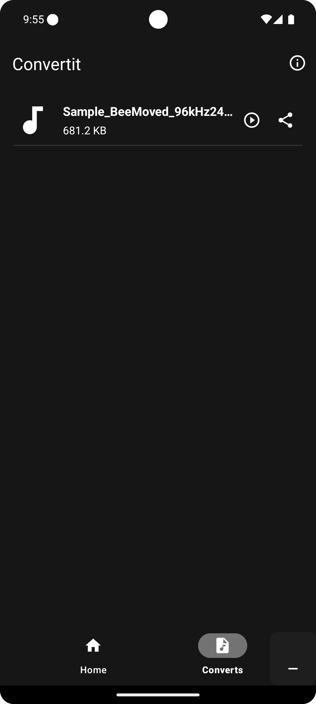
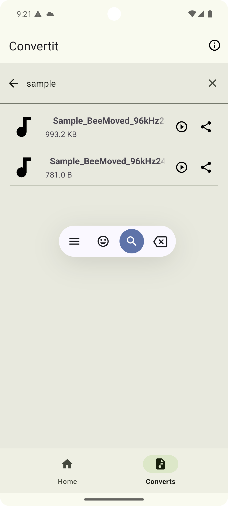
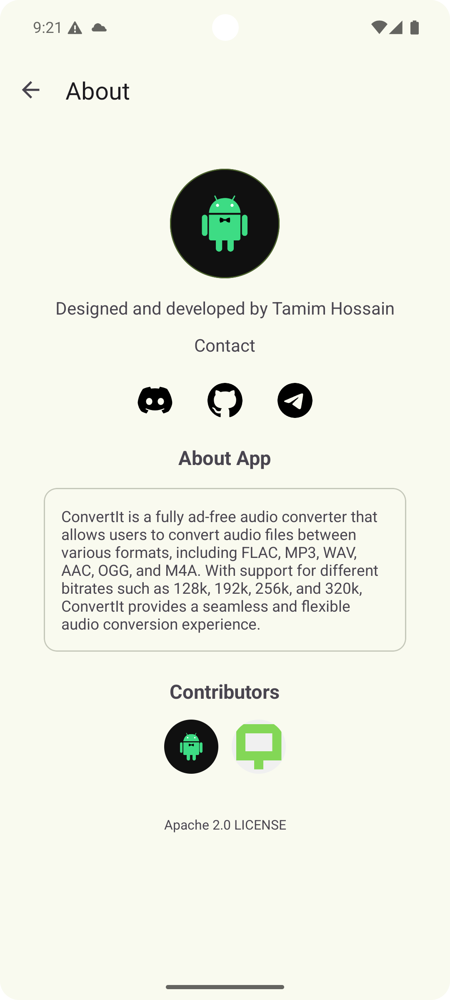

# 🎵 ConvertIt - Audio Converter App


**ConvertIt** is an **ad-free** and **easy-to-use** audio converter app that helps users convert audio files across different formats seamlessly. With **support for popular audio formats** and **customizable bitrates**, ConvertIt delivers high-quality conversions, powered by FFmpeg, all within a clean, user-friendly interface.

---

## 🚀 Features

- 🎧 **Audio Format Conversion**: Effortlessly convert between **FLAC, MP3, WAV, AAC, OGG, and M4A**.
- 🎚️ **Bitrate Selection**: Choose from bitrates such as **128k, 192k, 256k, and 320k** for output quality.
- 📱 **Ad-Free**: Enjoy a completely **ad-free** experience.
- 🔧 **FFmpeg Integration**: Built-in FFmpeg ensures **reliable and high-quality** conversions.
- 📐 **Modern Architecture**: Developed using **Kotlin** with **MVVM architecture** for better scalability and maintainability.
- 🧭 **Smooth Navigation**: Implemented using **Android Navigation Component** for easy and smooth in-app navigation.
- 🖥️ **User-Friendly UI**: Designed with simplicity and ease of use in mind, offering a clean and intuitive interface.

---

## 🖼️ Screenshots

<p align="left">
  
  
  
 
</p>

---

## 📱 Get It on Play Store

Download **ConvertIt** directly from the Play Store:

<p align="left">
  <a href="https://play.google.com/store/apps/details?id=com.nasahacker.convertit" target="_blank">
    
  </a>
</p>

---

## 🛠️ Requirements

- **Android**: Version **5.0 (Lollipop)** or later
- **Kotlin**: Version **1.3** or later
- **Android Studio**: Version **4.0** or later

---

## 🛠️ Installation

Follow these steps to install and run the app locally:

1. Clone the repository:
    ```bash
    git clone https://github.com/CodeWithTamim/ConvertIt.git
    ```

2. Open the project in **Android Studio**:
    ```bash
    open ConvertIt
    ```

3. Build and run the app on an Android device or emulator.

---

## 🤝 Contributions

Contributions are always welcome! Here's how you can contribute:

1. **Fork** the repository.
2. Create a **new branch** with your changes.
3. **Submit a pull request**.

Whether it's bug fixes, new features, or improvements, we appreciate your contribution!

---

## ⚖️ License

This project is licensed under the **Apache License 2.0**. See the [LICENSE](LICENSE) file for more information.

---

Developed with ❤️ by **Tamim**.
